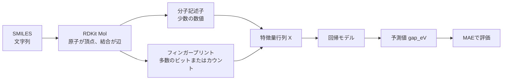
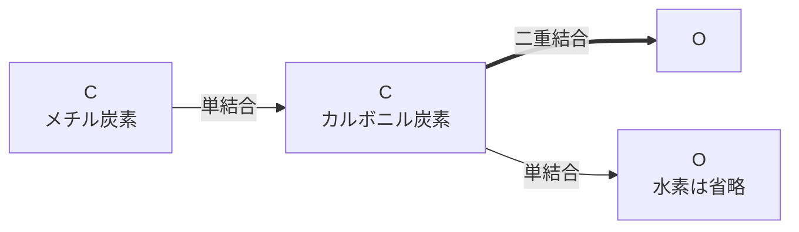
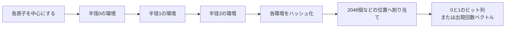

# Pythonセミナー第9回 用語調査

調査日：2026年7月19日

対象資料：[Pythonセミナー第９回.pptx](./Pythonセミナー第９回.pptx)

## 課題の全体像

今回の課題は、分子を表す `SMILES` から数値の特徴量を作り、分子の `gap_eV` を予測する回帰問題である。

配布データは訓練用15,000件とテスト用4,000件であり、訓練用CSVだけが正解の `gap_eV` を持つ。

評価指標は平均絶対誤差（MAE）であり、値が小さいモデルほどよい。

```math
\mathrm{MAE}=\frac{1}{n}\sum_{i=1}^{n}|y_i-\hat{y}_i|
```

スライドのヒントである「SMILESを変換して特徴量を生成する」は、次の処理を指す。



五つの用語の関係は、`QM9` がデータの出所、`SMILES` が分子の入力表現、`RDKit` が変換を行うライブラリ、分子記述子とフィンガープリントがモデルへ渡す特徴量、という対応になる。

## QM9と予測対象

分子物性を機械学習で扱うには、同じ計算条件で多数の分子を評価したデータが必要になる。

**QM9** は、その用途で広く使われている量子化学計算データセットであり、原論文ではGDB-9データセットとして説明されている。

QM9には、炭素、水素、窒素、酸素、フッ素からなる小さな有機分子133,885種が収録されている。

各分子は水素以外の原子を最大9個まで持ち、元の候補はGDB-17という化学空間から選ばれた。

平衡構造、双極子モーメント、分極率、HOMOとLUMOのエネルギー、熱力学量などが、統一された量子化学計算によって求められている。

原論文では、分子構造の最適化と物性計算にDFTのB3LYP/6-31G(2df,p)が使われたと説明されている。

したがってQM9の物性値は実験測定値ではなく、特定の計算方法による計算値である。

原典：[Quantum chemistry structures and properties of 134 kilo molecules](https://www.nature.com/articles/sdata201422)

### `gap_eV` が表すもの

QM9の `gap` は、最高被占分子軌道であるHOMOと最低空分子軌道であるLUMOのエネルギー差である。

```math
\varepsilon_{\mathrm{gap}}=\varepsilon_{\mathrm{LUMO}}-\varepsilon_{\mathrm{HOMO}}
```

この値が小さい分子では、占有軌道から空軌道へ電子を励起するために必要なエネルギーが比較的小さい。

ただし、この量は孤立分子のHOMO-LUMOギャップであり、結晶中の固体について定義するバンドギャップと厳密に同じ量ではない。

課題ファイル名にある「bandgap」は、この分子軌道の差を指す通称として読むのが適切である。

QM9原典の仕様表では `gap` の単位はHartree（Ha）だが、今回の配布CSVは列名が `gap_eV` なのでeVとして扱う。

1 Haは約27.2114 eVであるため、QM9本体から変換するときは次の関係を使う。

```math
E[\mathrm{eV}] \approx E[\mathrm{Ha}] \times 27.2114
```

今回の `gap_eV` はすでにeV単位なので、もう一度27.2114を掛けてはいけない。

根拠：[QM9の計算物性一覧](https://www.nature.com/articles/sdata201422/tables/4)、[NIST CODATAのHartree換算値](https://physics.nist.gov/cgi-bin/cuu/Results?search_for=hartree)

### QM9を使うときの範囲

QM9は小さな中性有機分子を中心とするため、このデータで学習したモデルの精度は同じような分子領域で評価する必要がある。

巨大分子、金属を含む錯体、イオン性化合物、固体へ、そのまま同じ精度で外挿できるとは限らない。

今回の訓練データとテストデータは同じ課題用データから作られているため、まずは配布された化学空間内での予測精度を上げる問題として扱う。

### 配布CSVを確認した結果

ローカルのCSVを確認すると、訓練データの `gap_eV` は最小約1.774 eV、平均約6.824 eV、最大約10.719 eVだった。

訓練データには、次の2種類のSMILESが各2回ずつ完全に重複しており、それぞれの正解値も同一だった。

- `c1c(ncc(n1)N)CO`

- `c1c(ncc(n1)O)C#N`

無作為分割で同じ分子が学習側と検証側へ分かれると、検証MAEを実力以上によく見せる可能性がある。

モデル検証前に重複を除くか、同じSMILESを必ず同じ分割へ入れる必要がある。

訓練データとテストデータの間には、文字列が完全一致するSMILESはなかった。

## RDKitの役割

SMILESは文字列のままでは、通常の回帰モデルが分子構造として解釈できない。

**RDKit** は、SMILESを分子グラフとして読み込み、構造の検査、描画、分子記述子の計算、フィンガープリントの生成などを行うオープンソースの化学情報学ライブラリである。

中核はC++で実装されており、Pythonから利用できる。

RDKit公式概要：[An overview of the RDKit](https://www.rdkit.org/docs/Overview.html)

今回の課題では、RDKitは予測モデルそのものではなく、次の前処理を担当する。

1. SMILESを読み込む。

2. 原子価、芳香族性、環構造などを検査してRDKitの `Mol` オブジェクトを作る。

3. `Mol` から分子記述子とフィンガープリントを計算する。

4. 生成した数値配列を回帰モデルへ渡す。

SMILESの解析に失敗する場合もあるため、特徴量生成前に失敗件数を確認する必要がある。

同じ分子を同じ規則で処理できるように、提出時にはRDKitのバージョンとフィンガープリントの設定値を記録する。

公式資料：[RDKit Getting Started](https://www.rdkit.org/docs/GettingStartedInPython.html)

## SMILESが表す分子グラフ

分子構造をファイルへ保存するには、原子と結合を文字で表す規則が必要になる。

**SMILES**（Simplified Molecular Input Line Entry System）は、分子を一行の文字列で表す線形表記法である。

SMILESを読み込むと、原子を頂点、結合を辺とする分子グラフが復元される。

[DaylightのSMILES仕様](https://www.daylight.com/dayhtml/doc/theory/theory.smiles.html)では、原子、結合、分岐、環の閉鎖、非結合成分を文字で指定する。

| 表記 | 意味 | 例 |
|---|---|---|
| `C`, `N`, `O`, `F` | 原子 | `CO` は炭素と酸素 |
| `c`, `n` | 芳香族原子 | `c1ccccc1` はベンゼン |
| 省略または `-` | 単結合 | `CC` はエタン |
| `=`, `#` | 二重結合、三重結合 | `C=O`, `C#N` |
| `(...)` | 分岐 | `CC(=O)O` |
| 対になった数字 | 環の閉鎖 | `C1CCCCC1` |
| `[...]` | 電荷、水素数、同位体などの明示 | `[NH4+]` |
| `@`, `@@` | 四面体中心の立体情報 | `N[C@@H](C)C(=O)O` |
| `.` | 結合していない成分の区切り | `[Na+].[Cl-]` |

### 酢酸の例

酢酸のSMILES `CC(=O)O` は、次の分子グラフを表す。



最初の `C` と次の `C` は、結合記号が省略されているため単結合でつながる。

括弧内の `=O` は二つ目の炭素から分岐した二重結合を表し、最後の `O` は単結合した酸素を表す。

水素原子は通常省略され、各原子の標準的な原子価から補われる。

### 同じ分子に複数のSMILESがある

SMILESは分子グラフをたどった順番で書くため、同じ分子を表す有効な文字列が複数存在する。

たとえばエタノールは `CCO` と `OCC` のどちらでも表せる。

**Canonical SMILES** は、ソフトウェアが一つの代表表記へ正規化したSMILESである。

ただし、互変異性体、プロトン化状態、芳香族性の扱いが違えば、Canonical SMILESだけですべてが同一表記になるわけではない。

今回のようにRDKitで一括処理すると、文字の並びそのものではなく、復元した分子グラフから同じ方法で特徴量を計算できる。

## 分子記述子

回帰モデルは、各分子を同じ長さの数値列として受け取る。

**分子記述子**（molecular descriptor）は、分子量、原子数、環の数、極性など、分子構造の一つの性質を一つまたは少数の数値で表した特徴量である。

記述子の値は比較的解釈しやすく、どの性質が予測へ寄与したかを調べやすい。

今回の候補には次のようなものがある。

| RDKitの記述子または計算値 | 表すもの | `gap_eV` との関係を期待する理由 |
|---|---|---|
| `MolWt`, `ExactMolWt` | 分子量 | 分子サイズと元素組成の違いを表す |
| `HeavyAtomCount` | 水素以外の原子数 | QM9内での分子サイズを表す |
| C、N、O、Fの原子数 | 元素ごとの個数 | 電気陰性度と電子構造の違いを表す |
| `RingCount` | 環の数 | 環状構造と共役系の有無を間接的に表す |
| `NumAromaticRings` | 芳香環の数 | π共役の広がりを間接的に表す |
| `FractionCSP3` | sp3炭素の割合 | 飽和構造と共役構造の違いを表す |
| `TPSA` | トポロジカル極性表面積 | NとOを中心とする極性構造を表す |
| `MolLogP` | 分配係数の推定値 | 組成と極性の補助的な指標になる |
| `NumHDonors`, `NumHAcceptors` | 水素結合供与体と受容体の数 | ヘテロ原子周辺の化学環境を表す |
| `MaxEStateIndex`, `MinEStateIndex` | 原子の電子的環境を集約した値 | 局所的な電子環境の違いを表す |

これらは構造から計算する代理変数であり、HOMO-LUMOギャップを直接計算する量子化学計算ではない。

RDKitは利用可能な記述子を一括計算でき、公式文書の現行例では208列が生成される。

記述子の種類と個数はRDKitの版によって変わりうるため、再現性を優先する場合は使用する記述子名を明示的に固定するほうがよい。

公式例：[RDKit Descriptor Calculation](https://www.rdkit.org/docs/GettingStartedInPython.html#descriptor-calculation)

### 2次元記述子と3次元記述子

SMILESから結合関係だけで計算できる原子数、環数、TPSAなどは、主に2次元記述子として扱われる。

分子の形状、慣性主軸、回転半径などの3次元記述子には、原子の3次元座標を持つコンフォマーが必要になる。

今回配布されたCSVにはSMILESしかないため、3次元記述子を使う場合はRDKitで立体構造を生成して最適化する工程が増える。

RDKitが生成した立体構造はQM9原典のDFT最適化構造そのものではないため、最初の基準モデルでは2次元記述子から始めるほうが比較しやすい。

### 記述子をモデルへ入れるときの注意

- 値の桁が大きく異なるため、線形回帰、ニューラルネットワーク、距離に基づくモデルでは標準化を検討する。

- 木ベースのモデルでは、通常は標準化が必須ではない。

- 全分子で同じ値になる列、欠損値が多い列、ほぼ同じ情報を持つ列は整理する。

- 記述子を選ぶ処理も訓練データの各分割内で行い、検証データの正解値を使って選ばない。

## フィンガープリント

分子全体を少数の物性値へ集約すると、特定の官能基や結合パターンが失われることがある。

**分子フィンガープリント**（molecular fingerprint）は、分子内にどのような部分構造が存在するかを、固定長のビット列または出現回数のベクトルで表した特徴量である。

たとえば2048ビットのフィンガープリントでは、各分子が `[0, 1, 0, ..., 1]` のような同じ長さの疎なベクトルになる。

記述子が「分子量は何か」のような集約値を表すのに対し、フィンガープリントは「この局所構造を含むか」を細かく記録する。

### Morganフィンガープリント

今回の課題で最初に試しやすいのは、**Morganフィンガープリント**である。

Morganフィンガープリントは各原子を中心に近傍を半径0、1、2のように広げ、得られた局所構造をハッシュ値へ変換する円形フィンガープリントである。

`radius=2` は、一般にECFP4相当と呼ばれる設定である。



固定長へ圧縮するため、異なる部分構造が同じ位置へ割り当てられるハッシュ衝突が起こりうる。

ビット数を増やすと衝突は減りやすいが、特徴量数とメモリ使用量が増える。

RDKitでは、Morganフィンガープリントの半径、ビット数、結合種、キラリティの有無などを設定できる。

公式API：[RDKit Fingerprint Generator](https://www.rdkit.org/docs/source/rdkit.Chem.rdFingerprintGenerator.html)

### ビット型とカウント型

| 形式 | 値 | 長所 | 注意点 |
|---|---:|---|---|
| ビット型 | 0または1 | 単純で疎行列として扱いやすい | 同じ部分構造が何個あるかを失う |
| カウント型 | 0以上の整数 | 部分構造の出現回数を残す | 値の分布とモデルの相性を確認する必要がある |

小分子だけを含むQM9では、ビット型とカウント型の両方を同じ分割で比較する価値がある。

### RDKitで使える主な種類

| 種類 | 主に符号化するもの | 用途のイメージ |
|---|---|---|
| Morgan | 各原子の周囲にある円形の局所構造 | 一般的な構造類似性と機械学習 |
| RDKit fingerprint | 分子グラフ上の経路と部分グラフ | 結合経路のパターン |
| Atom Pair | 原子の種類と原子間のトポロジカル距離 | 離れた原子の関係 |
| Topological Torsion | 連続する原子列 | 結合系列のパターン |

フィンガープリントは3次元座標や量子軌道を直接持たないため、HOMO-LUMOギャップを完全に記述する表現ではない。

しかし、結合種、芳香環、ヘテロ原子周辺の局所構造を多数保持できるため、SMILESだけから作る強い基準特徴量になる。

## 分子記述子とフィンガープリントの違い

| 比較項目 | 分子記述子 | フィンガープリント |
|---|---|---|
| 主な内容 | 分子全体を表す物性値と個数 | 局所的な部分構造 |
| 値の形式 | 実数または整数 | 0と1、または出現回数 |
| 特徴量数 | 数十から数百程度 | 1024、2048などが一般的 |
| 解釈 | 比較的しやすい | 各ビットは解釈しにくい |
| 行列の性質 | 密になりやすい | 疎になりやすい |
| 得意な情報 | サイズ、組成、極性、全体的形状 | 官能基、結合パターン、局所環境 |
| 苦手な情報 | 細かな部分構造を失う場合がある | 分子全体の連続的な物性を直接表しにくい |

両者は競合する表現ではなく、異なる情報を持つ。

分子記述子だけ、Morganフィンガープリントだけ、両方を連結した特徴量、という三条件を同じ検証分割で比較すると、どの情報が `gap_eV` に効くかを確認できる。

## 課題へ進むときの確認項目

1. RDKitで全SMILESを読み込み、分子として解釈できない文字列がないか確認する。

2. 完全重複したSMILESを除くか、同じ検証グループへまとめる。

3. 分子記述子、Morganビット型、両者の連結を同じ分割とシード値で比較する。

4. 検証指標をスライド指定のMAEに統一する。

5. フィンガープリントの半径、ビット数、キラリティの扱い、使用した記述子名、RDKitのバージョンを記録する。

6. 最終的な `submission.csv` は、テストCSVと同じ行順の `smiles,gap_eV` 形式にする。

スライドにある「提出可能なモデルは最大3個」は提出回数または提出モデルの制限であり、手元で比較する特徴量やモデルを3種類までに制限する意味ではない。

## 用語の一文整理

- **QM9**：小さな有機分子について量子化学計算した構造と物性を集めたデータセットである。

- **RDKit**：SMILESを分子グラフへ変換し、記述子やフィンガープリントを計算する化学情報学ライブラリである。

- **SMILES**：原子、結合、分岐、環、立体情報などを一行の文字列で表す分子表記法である。

- **分子記述子**：分子量、原子数、環数、極性などを意味のある数値へ集約した特徴量である。

- **フィンガープリント**：分子内の多数の部分構造を固定長のビット列またはカウント列へ符号化した特徴量である。

## 参照資料

- Pythonセミナー第9回スライド：[Pythonセミナー第９回.pptx](./Pythonセミナー第９回.pptx)

- QM9原論文：[Ramakrishnan et al., Quantum chemistry structures and properties of 134 kilo molecules](https://www.nature.com/articles/sdata201422)

- QM9の物性と単位：[Table 3 Calculated properties](https://www.nature.com/articles/sdata201422/tables/4)

- RDKit公式概要：[An overview of the RDKit](https://www.rdkit.org/docs/Overview.html)

- RDKit記述子：[Getting Started with the RDKit in Python, Descriptor Calculation](https://www.rdkit.org/docs/GettingStartedInPython.html#descriptor-calculation)

- RDKitフィンガープリントAPI：[rdkit.Chem.rdFingerprintGenerator](https://www.rdkit.org/docs/source/rdkit.Chem.rdFingerprintGenerator.html)

- SMILES仕様：[Daylight Theory, SMILES](https://www.daylight.com/dayhtml/doc/theory/theory.smiles.html)

- HartreeとeVの換算：[NIST CODATA Values](https://physics.nist.gov/cgi-bin/cuu/Results?search_for=hartree)
