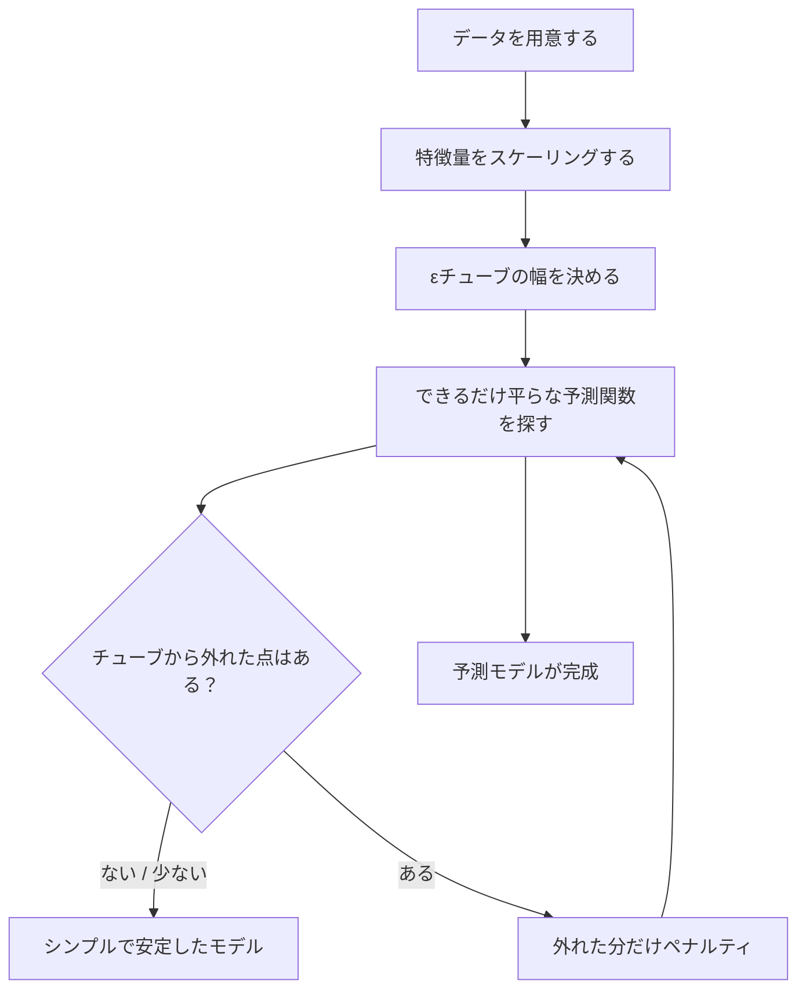
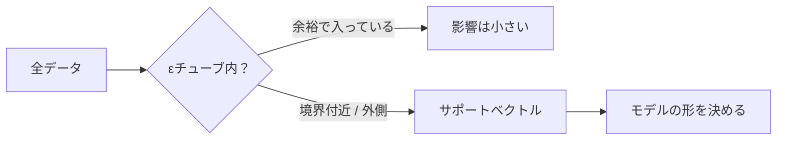
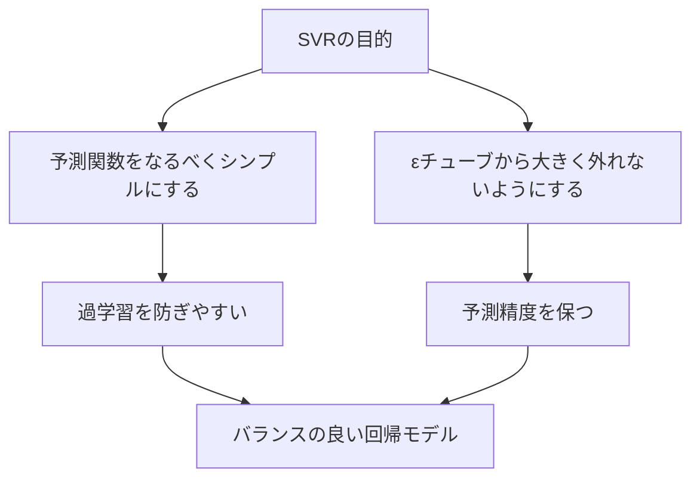
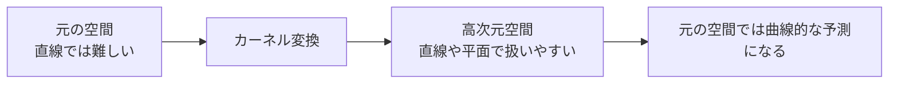
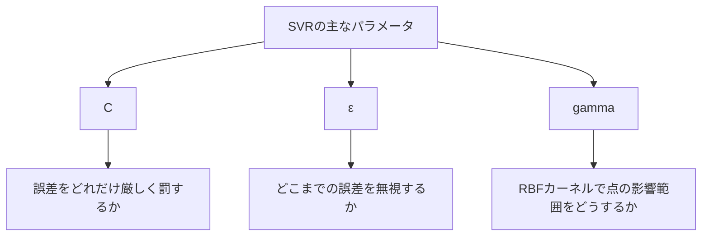
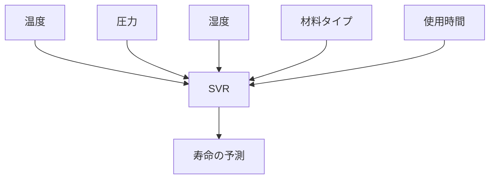
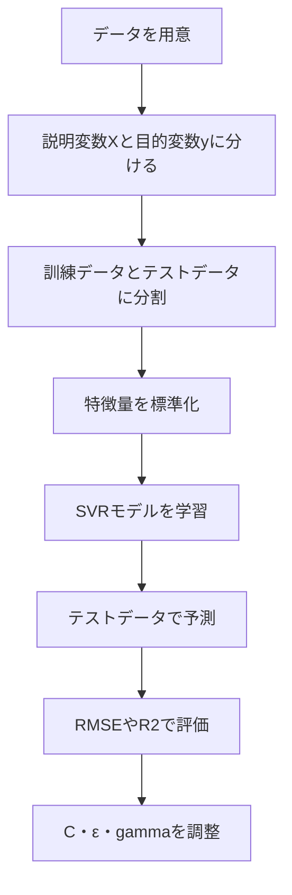
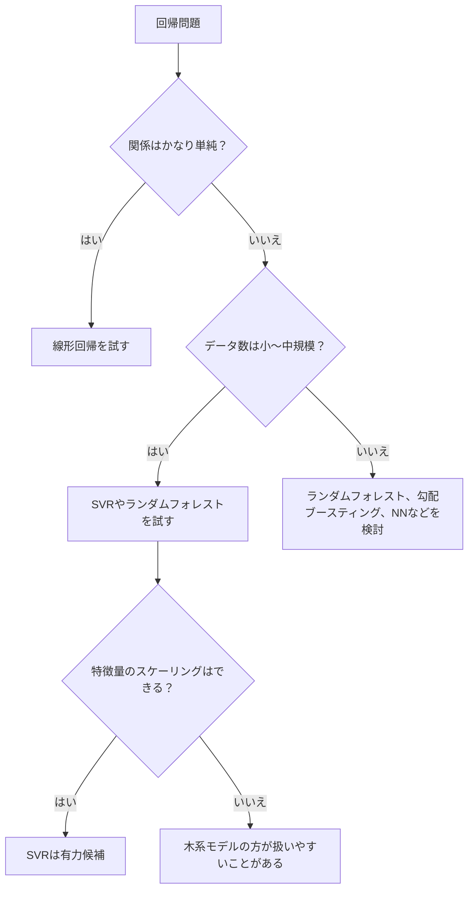
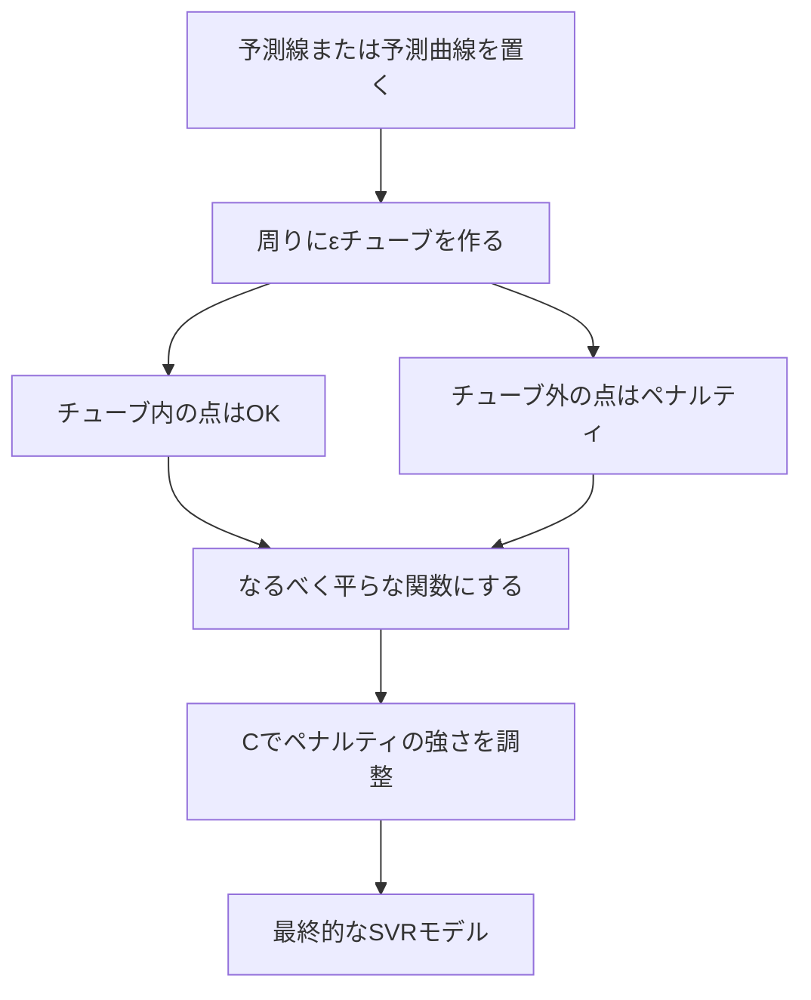
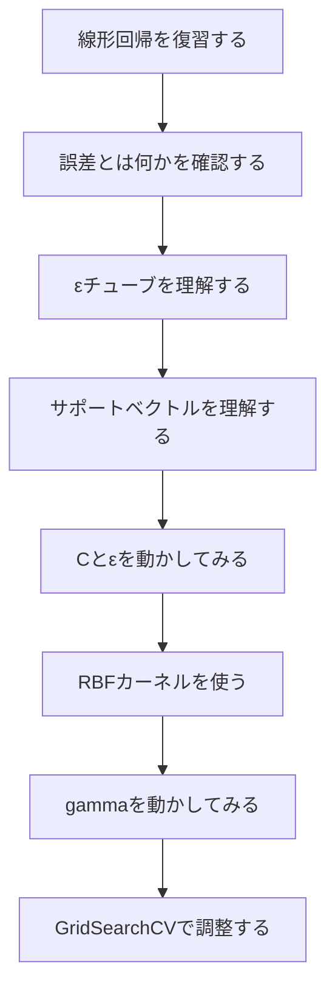

# SVR（Support Vector Regression）の原理と特徴

## 1. SVRをひとことで言うと

SVR（Support Vector Regression）は、**「少しくらいのズレは気にしない幅」を持たせながら、なるべくシンプルな線や曲線で予測する回帰モデル**です。

通常の回帰では、予測値と実測値のズレをできるだけ小さくしようとします。

一方でSVRは、

> 「このくらいの誤差ならOK」

という許容範囲を先に決めます。

その許容範囲の中に入っているデータは、予測が十分当たっているとみなします。

---

## 2. まずは普通の回帰との違い

### 普通の回帰の考え方

普通の線形回帰は、すべての点とのズレをなるべく小さくしようとします。

```text
実測値 y
  ^
  |
8 |                         *
7 |                    *
6 |              *
5 |         *
4 |    *
3 |
  +--------------------------------> 入力 x
       1    2    3    4    5

目的:
すべての点から予測直線までの距離をできるだけ小さくする
```

線形回帰のイメージ：

```text
点から線までのズレを全部気にする

        *
       /|
      / | ← このズレも気にする
-----/--|---------------- 予測線
    /   |
   *
```

### SVRの考え方

SVRは、予測線の周りに**許容幅**を作ります。

この幅のことを **εチューブ（イプシロン・チューブ）** と呼びます。

```text
実測値 y
  ^
  |
8 |                         *
7 |                  =======+=======  εチューブ上側
6 |             ====        |  
5 |        ====             |  予測線
4 |   =====                 |
3 |=========================+=======  εチューブ下側
  +--------------------------------> 入力 x
       1    2    3    4    5

チューブの中の点:
「このくらいのズレならOK」と考える

チューブの外の点:
「これは大きなズレなので修正したい」と考える
```

つまり、SVRは次のように考えます。

```text
チューブ内の誤差  →  無視してよい
チューブ外の誤差  →  ペナルティを与える
```

---

## 3. SVRの中心アイデア

SVRの重要な考え方は3つです。

1. **εチューブ**  
   小さな誤差を無視するための許容範囲。

2. **サポートベクトル**  
   モデルを決めるのに重要な一部のデータ点。

3. **カーネル**  
   直線では表せない関係を、曲線のように扱うための仕組み。

全体像は次のようになります。



---

## 4. εチューブとは何か

SVRでは、予測関数を次のように考えます。

$$
f(x) = wx + b
$$

これはシンプルな直線の式です。

```text
f(x): 予測値
x   : 入力データ
w   : 傾き
b   : 切片
```

SVRは、この直線の上下に幅 ε のチューブを作ります。

```text
                εチューブ上側
             -------------------
            /
           /      ← この中なら誤差0扱い
          /
---------/----------------------  f(x): 予測線
        /
       /       ← この中なら誤差0扱い
      /
   -------------------
      εチューブ下側
```

### 例：ε = 2 の場合

ある商品の売上を予測するとします。

| 実際の売上 | 予測売上 | 誤差 | SVRでの扱い |
|---:|---:|---:|---|
| 100 | 101 | 1 | ε以内なので気にしない |
| 100 | 98 | 2 | ε以内なので気にしない |
| 100 | 95 | 5 | εを超えた分だけペナルティ |
| 100 | 106 | 6 | εを超えた分だけペナルティ |

ε = 2 なら、誤差が2以内の予測は「十分当たっている」とみなします。

---

## 5. SVRの損失関数：ε-insensitive loss

SVRでは、誤差がε以内なら損失を0にします。

これを **ε-insensitive loss** と呼びます。

日本語にすると、

> ε以内の誤差には鈍感な損失

という意味です。

### 損失のイメージ

```text
損失
 ^
 |
 |                         /
 |                        /
 |                       /
 |                      /
 |_____________________/____________________> 誤差
 |       -ε      0      ε
 |              損失0
 |
 |      \____________________
 |       \
 |        \
```

もう少し具体的に見ると、

```text
誤差が -ε から +ε の間
→ 損失は0

誤差が ε より大きい
→ はみ出した分だけ損失

誤差が -ε より小さい
→ はみ出した分だけ損失
```

式で書くと次のようになります。

$$
L(y, f(x)) = \max(0, |y - f(x)| - \epsilon)
$$

```text
y       : 実際の値
f(x)    : 予測値
|y-f(x)|: 予測誤差の大きさ
ε       : 許容する誤差の幅
```

### 数値例

ε = 3 とします。

| 実測値 y | 予測値 f(x) | 誤差の大きさ | 損失 |
|---:|---:|---:|---:|
| 50 | 51 | 1 | 0 |
| 50 | 53 | 3 | 0 |
| 50 | 55 | 5 | 2 |
| 50 | 44 | 6 | 3 |

ポイントは、**実際の誤差そのものではなく、εからはみ出した分だけを問題にする**ことです。

---

## 6. サポートベクトルとは何か

SVRでは、すべてのデータ点が同じように重要なわけではありません。

モデルを決めるうえで重要なのは、主に次のような点です。

1. εチューブの境界に近い点
2. εチューブの外にはみ出した点

これらを **サポートベクトル** と呼びます。

```text
実測値 y
  ^
  |
  |          *  ← チューブ外なので重要
  |       --------------------  上側チューブ
  |      *       *       *
  |    --------------------    予測線
  |        *       *
  |       --------------------  下側チューブ
  |  *  ← チューブ外なので重要
  |
  +--------------------------------> x

重要:
チューブの中に余裕で入っている点は、モデルへの影響が小さい
```

### 直感的な説明

SVRは、全員の意見を同じ重みで聞くのではなく、

> 「境界付近にいる点」  
> 「予測から大きく外れている点」

の声を強く聞きます。

だから、データがたくさんあっても、最終的なモデルは一部の重要な点によって決まります。



---

## 7. 「なるべく平らな関数」を選ぶ

SVRは、ただ誤差を小さくするだけではありません。

同時に、予測関数をなるべくシンプルにしようとします。

線形SVRなら、

$$
f(x) = wx + b
$$

の **w** をなるべく小さくしようとします。

なぜなら、wが大きいほど線が急になり、データの小さな変化に敏感になるからです。

```text
ゆるやかな線:

y
^
|       /
|     /
|   /
| /
+----------------> x

急な線:

y
^
|          /
|       /
|    /
| /
+----------------> x

急な線は、xが少し変わるだけで予測値が大きく変わる
```

SVRは次の2つのバランスを取ります。



---

## 8. C：どれくらい誤差を許すか

SVRでとても重要なパラメータが **C** です。

Cは、

> チューブの外にはみ出した誤差を、どれくらい厳しく罰するか

を決めます。

### Cが大きい場合

Cが大きいと、誤差を強く嫌います。

```text
Cが大きい
→ はみ出しを強く罰する
→ データにぴったり合わせようとする
→ 精度が上がることもある
→ ただし過学習しやすい
```

図で見ると、

```text
データにかなり合わせる

y
^
|       *       *
|     /   \   /
|    /     \ /
| * /       *
|  /
+----------------> x
```

### Cが小さい場合

Cが小さいと、多少の誤差を許します。

```text
Cが小さい
→ はみ出しをあまり強く罰しない
→ なめらかなモデルになりやすい
→ 外れ値に強くなりやすい
→ ただし単純すぎる場合もある
```

図で見ると、

```text
なめらかでシンプル

y
^
|       *       *
|      *
|    *      *
|  *
| /
+----------------> x
```

### Cのイメージ

| C | モデルの性格 | メリット | デメリット |
|---:|---|---|---|
| 小さい | おおらか | 外れ値に引っ張られにくい | 単純すぎることがある |
| 大きい | 厳しい | 学習データに合いやすい | 過学習しやすい |

---

## 9. ε：どこまでの誤差を無視するか

εは、チューブの幅です。

```text
εが小さい → チューブが細い
εが大きい → チューブが太い
```

### εが小さい場合

```text
細いチューブ

      ----------------  上側
------ 予測線
      ----------------  下側

少しのズレでもチューブ外になりやすい
```

特徴：

| εが小さい | 内容 |
|---|---|
| 良い点 | 細かい誤差まで見ようとする |
| 悪い点 | ノイズにも反応しやすい |
| サポートベクトル | 多くなりやすい |

### εが大きい場合

```text
太いチューブ

----------------------  上側

---------- 予測線

----------------------  下側

多少のズレは無視される
```

特徴：

| εが大きい | 内容 |
|---|---|
| 良い点 | ノイズに強くなりやすい |
| 悪い点 | 細かい変化を見逃すことがある |
| サポートベクトル | 少なくなりやすい |

---

## 10. カーネル：曲線を扱う仕組み

ここまでの説明では直線を考えてきました。

しかし現実のデータは、直線では表せないことが多いです。

たとえば、気温とアイスの売上は単純な直線ではないかもしれません。

```text
気温が低い   → 売れない
気温が上がる → 売れる
暑すぎる     → 外出が減って伸びにくい
```

このような関係は曲線で表したいです。

```text
売上
^
|             *
|          *     *
|       *
|    *
| *
+----------------------> 気温
```

SVRでは **カーネル** を使うことで、曲線的な関係を扱えます。

### カーネルの直感

カーネルは、データを高次元空間に写して、そこで線形に扱うテクニックです。



### 2次元では分けにくいものが、3次元では扱いやすくなるイメージ

```text
元の空間:

y
^
|      *   *
|   *         *
|      *   *
+----------------> x

直線1本ではうまく表せない
```

```text
高次元に持ち上げる:

z
^
|          *
|      *       *
|   *             *
|______________________> x,y

高次元では平面で扱えることがある
```

---

## 11. よく使うカーネル

SVRでよく使うカーネルは次の通りです。

| カーネル | scikit-learnでの指定 | 向いている場面 |
|---|---|---|
| 線形カーネル | `kernel="linear"` | 関係がほぼ直線的なとき |
| 多項式カーネル | `kernel="poly"` | 曲線だが、次数で表せそうなとき |
| RBFカーネル | `kernel="rbf"` | 非線形な関係を柔軟に表したいとき |
| シグモイドカーネル | `kernel="sigmoid"` | ニューラルネット風の形を試したいとき |

実務や学習では、まず次の2つを試すことが多いです。

```text
1. linear
   → まず基準として試す

2. rbf
   → 非線形関係を柔軟に扱いたいときに試す
```

---

## 12. RBFカーネルとgamma

RBFカーネルを使うときに重要なのが **gamma** です。

gammaは、

> 1つ1つのデータ点の影響範囲

を決めるパラメータです。

### gammaが小さい場合

gammaが小さいと、1つの点の影響が広くなります。

```text
gammaが小さい
→ 広くなめらかに影響する
→ モデルはゆるやか
→ 単純すぎる可能性もある
```

```text
影響範囲が広い

          _________
       __/         \__
______/               \______
```

### gammaが大きい場合

gammaが大きいと、1つの点の影響が狭くなります。

```text
gammaが大きい
→ 近くの点だけに強く影響する
→ モデルは細かく曲がる
→ 過学習しやすい
```

```text
影響範囲が狭い

        /\
_______/  \_______
```

### gammaのイメージ

| gamma | 影響範囲 | モデルの形 | 注意点 |
|---:|---|---|---|
| 小さい | 広い | なめらか | 単純すぎることがある |
| 大きい | 狭い | 複雑 | 過学習しやすい |

---

## 13. C・ε・gammaの関係

SVRの代表的な調整パラメータは次の3つです。



### ざっくり比較

| パラメータ | 大きくすると | 小さくすると |
|---|---|---|
| C | 学習データに強く合わせる | 誤差におおらかになる |
| ε | 誤差を広く無視する | 小さい誤差も気にする |
| gamma | 細かく曲がる | なめらかになる |

### 性格でたとえると

| 設定 | モデルの性格 |
|---|---|
| C大・ε小・gamma大 | とても細かく、データに合わせにいく |
| C小・ε大・gamma小 | おおらかで、なめらかな予測をする |
| C中・ε中・gamma中 | バランス型 |

---

## 14. 具体例1：家賃を予測する

部屋の広さから家賃を予測するとします。

| 部屋の広さ m2 | 家賃 万円 |
|---:|---:|
| 20 | 6 |
| 25 | 7 |
| 30 | 8 |
| 35 | 9 |
| 40 | 11 |
| 45 | 13 |
| 50 | 16 |

### 線形回帰なら

```text
家賃
^
|                *
|            *
|        *
|     *
|  *
+----------------------> 広さ

全体として右上がりの直線を引く
```

### SVRなら

```text
家賃
^
|                *   ← チューブ外なら重要
|           ===============  εチューブ上側
|       ====     *
|   ====  *
|=== * ================  予測線
|   ==== 
|       ===============  εチューブ下側
+----------------------> 広さ

チューブ内に入る点は細かく気にしない
```

SVRは、

```text
多少のズレは許す
でも全体として家賃が上がる傾向を捉える
```

という予測をします。

---

## 15. 具体例2：材料の寿命を予測する

材料の寿命を予測する問題を考えます。

入力データの例：

| 特徴量 | 意味 |
|---|---|
| 温度 | 使用環境の温度 |
| 圧力 | 使用時の圧力 |
| 湿度 | 使用環境の湿度 |
| 材料タイプ | 金属、樹脂など |
| 使用時間 | どれくらい使ったか |

予測したい値：

```text
材料の寿命
```

### 現実の関係は直線とは限らない

温度が上がると寿命が短くなるとしても、完全な直線ではないかもしれません。

```text
寿命
^
| *
|   *
|      *
|          *
|                *
+----------------------> 温度
```

さらに、温度と湿度が組み合わさると、影響が急に大きくなるかもしれません。

```text
温度が高いだけ       → 少し寿命が短くなる
湿度が高いだけ       → 少し寿命が短くなる
温度も湿度も高い     → 一気に寿命が短くなる
```

このような非線形な関係には、RBFカーネルのSVRが候補になります。



---

## 16. SVRを使うときの基本手順

SVRは、特にスケーリングが大切です。

特徴量の単位がバラバラだと、距離の計算がうまく働きにくくなります。



### なぜスケーリングが必要か

たとえば、次の2つの特徴量があるとします。

| 特徴量 | 値の範囲 |
|---|---:|
| 年齢 | 20〜80 |
| 年収 | 2,000,000〜10,000,000 |

このまま距離を計算すると、年収の数字が大きすぎて、年齢の影響がほとんど見えなくなります。

```text
スケーリング前:

年齢の差  : 10
年収の差  : 1,000,000

→ 年収の影響が大きく見えすぎる
```

標準化すると、

```text
平均を0、標準偏差を1にそろえる

→ 各特徴量を公平に扱いやすくなる
```

---

## 17. scikit-learnでの実装例

SVRは、`sklearn.svm.SVR` で使えます。

### 最小例

```python
from sklearn.svm import SVR

model = SVR(kernel="rbf", C=10, epsilon=0.1, gamma="scale")
model.fit(X_train, y_train)

y_pred = model.predict(X_test)
```

ただし、実際にはスケーリングとセットで使うことが多いです。

### Pipelineを使う例

```python
from sklearn.pipeline import Pipeline
from sklearn.preprocessing import StandardScaler
from sklearn.svm import SVR
from sklearn.metrics import mean_squared_error, r2_score

model = Pipeline([
    ("scaler", StandardScaler()),
    ("svr", SVR(kernel="rbf", C=10, epsilon=0.1, gamma="scale"))
])

model.fit(X_train, y_train)

y_pred = model.predict(X_test)

mse = mean_squared_error(y_test, y_pred)
r2 = r2_score(y_test, y_pred)

print("MSE:", mse)
print("R2:", r2)
```

### パラメータ探索の例

```python
from sklearn.model_selection import GridSearchCV
from sklearn.pipeline import Pipeline
from sklearn.preprocessing import StandardScaler
from sklearn.svm import SVR

pipe = Pipeline([
    ("scaler", StandardScaler()),
    ("svr", SVR())
])

param_grid = {
    "svr__kernel": ["linear", "rbf"],
    "svr__C": [0.1, 1, 10, 100],
    "svr__epsilon": [0.01, 0.1, 0.5, 1.0],
    "svr__gamma": ["scale", 0.01, 0.1, 1.0]
}

search = GridSearchCV(
    pipe,
    param_grid,
    scoring="r2",
    cv=5
)

search.fit(X_train, y_train)

print("Best params:", search.best_params_)
print("Best score:", search.best_score_)
```

---

## 18. SVRの長所

SVRの主な長所は次の通りです。

| 長所 | 説明 |
|---|---|
| 小〜中規模データで強い | データ数が極端に多くない場合に高精度を出しやすい |
| 非線形関係に対応できる | RBFカーネルなどで曲線的な関係を表現できる |
| 外れ値に比較的強い | εチューブにより、小さな誤差を無視できる |
| 過学習を抑えやすい | なるべくシンプルな関数を選ぶ考え方がある |
| サポートベクトルで決まる | 重要な点に注目してモデルを作る |

---

## 19. SVRの短所

一方で、SVRには注意点もあります。

| 短所 | 説明 |
|---|---|
| スケーリングがほぼ必須 | 特徴量の尺度に敏感 |
| パラメータ調整が重要 | C、ε、gammaで結果が大きく変わる |
| 大規模データに弱いことがある | データ数が多いと学習が重くなりやすい |
| 解釈性が低め | 線形回帰ほど係数を直感的に読みにくい |
| カテゴリ変数は前処理が必要 | One-Hot Encodingなどが必要 |

---

## 20. 他の回帰モデルとの比較

| モデル | 得意なこと | 苦手なこと | 解釈しやすさ |
|---|---|---|---|
| 線形回帰 | 単純な直線関係 | 複雑な非線形 | 高い |
| 決定木 | ルール的な分岐 | 過学習しやすい | 中程度 |
| ランダムフォレスト | 複雑な関係 | モデルが大きくなる | 中程度 |
| SVR | 小〜中規模の非線形回帰 | 大規模データ、パラメータ調整 | 低〜中 |
| ニューラルネット | 大規模で複雑な関係 | データ量と調整が必要 | 低い |

### 使い分けの目安



---

## 21. SVRが向いているケース

SVRは、次のようなケースで向いています。

```text
データ数:
数百〜数万程度

特徴量:
数値特徴量が中心

関係:
直線だけではなさそう

目的:
予測精度を高めたい
```

具体例：

| 予測したいもの | 入力例 |
|---|---|
| 住宅価格 | 広さ、駅距離、築年数、地域 |
| 材料寿命 | 温度、圧力、湿度、材質 |
| 電力需要 | 気温、曜日、時間帯 |
| 売上 | 広告費、価格、季節 |
| 交通量 | 時刻、天気、曜日 |

---

## 22. SVRが向いていないことがあるケース

次のような場合は、他のモデルも検討した方がよいです。

| ケース | 理由 |
|---|---|
| データが非常に多い | 学習時間が長くなりやすい |
| 特徴量の意味を説明したい | 線形回帰や決定木系の方が説明しやすい |
| カテゴリ変数が大量にある | 前処理が複雑になりやすい |
| リアルタイムに頻繁な再学習が必要 | 学習コストが問題になることがある |

---

## 23. 図でまとめるSVR

### SVRのイメージ図

```text
                         チューブ外の点
                              *

                =========================
              //                         \\  εチューブ上側
             //      *       *            \\
------------//-----------------------------\\------ 予測関数
           //             *                 \\
          //       *                         \\
         =========================

   チューブ内の点は細かく気にしない
   チューブ外の点はペナルティ
```

### 学習の考え方



### パラメータの調整イメージ

```text
C      : 厳しさ
ε      : 許容幅
gamma  : 曲がりやすさ

厳しさを上げる       → Cを大きくする
許容幅を広げる       → εを大きくする
細かく曲げる         → gammaを大きくする
なめらかにする       → gammaを小さくする
```

---

## 24. よくある失敗と対策

### 失敗1：スケーリングせずに使う

```text
症状:
予測精度が悪い
パラメータを変えても改善しにくい

対策:
StandardScalerを使う
Pipelineに入れる
```

### 失敗2：Cを大きくしすぎる

```text
症状:
訓練データでは良い
テストデータでは悪い

対策:
Cを小さくする
交差検証で確認する
```

### 失敗3：gammaを大きくしすぎる

```text
症状:
予測曲線が細かく曲がりすぎる
ノイズまで覚えてしまう

対策:
gammaを小さくする
gamma="scale"から試す
```

### 失敗4：εを小さくしすぎる

```text
症状:
小さな誤差まで追いかける
サポートベクトルが増えすぎる

対策:
εを少し大きくする
目的変数の単位に合わせて考える
```

---

## 25. SVRを理解するためのたとえ

SVRは、点の集まりに対して「道」を作るようなものです。

```text
データ点 = 道路沿いの家
予測関数 = 道路の中心線
εチューブ = 道路の幅
```

```text
家が道路の幅の中にある
→ だいたい道沿いなので問題なし

家が道路から大きく外れている
→ 道路の位置を考え直す材料になる
```

```text
                家
                 *

       =======================
       |                     |
       |       道路幅         |
-------|-------中心線---------|-------
       |                     |
       |                     |
       =======================

道路幅の中の家はOK
大きく外の家は重要
```

---

## 26. 最重要ポイントだけ再確認

SVRを理解するうえで一番大切なのは、次の4つです。

1. **SVRは回帰モデルである**  
   数値を予測するために使う。

2. **εチューブを使う**  
   小さな誤差を無視する。

3. **サポートベクトルがモデルを決める**  
   境界付近や外側の重要な点に注目する。

4. **カーネルで非線形に対応できる**  
   RBFカーネルなどを使うと曲線的な関係も扱える。

---

## 27. 最後のまとめ

SVRは、

```text
「多少のズレは気にしない」
「でも大きく外れる点はちゃんと見る」
「できるだけシンプルな形で予測する」
「必要ならカーネルで曲線も表現する」
```

という考え方の回帰モデルです。

### ひとことで覚えるなら

> SVRは、予測線の周りに許容範囲を作り、その範囲から外れた重要な点を見ながら、なめらかで汎化しやすい回帰モデルを作る手法。

### パラメータの覚え方

| パラメータ | 何を決めるか | 覚え方 |
|---|---|---|
| C | 外れた誤差への厳しさ | Cが大きいほど厳しい |
| ε | 許容する誤差の幅 | εが大きいほどおおらか |
| gamma | RBFの曲がりやすさ | gammaが大きいほど細かく曲がる |

---

## 28. 学習時のおすすめ順序

SVRを実際に学ぶときは、次の順で進めると理解しやすいです。



### 実験すると理解しやすいこと

| 実験 | 見るポイント |
|---|---|
| Cを変える | データにどれくらい合わせにいくか |
| εを変える | サポートベクトルの数がどう変わるか |
| gammaを変える | 曲線がどれくらい細かく曲がるか |
| kernelを変える | 線形と非線形の違い |

---

## 29. ミニ確認問題

### 問1

SVRで「このくらいの誤差なら気にしない」と決める幅は何と呼ばれるでしょうか。

<details>
<summary>答え</summary>

εチューブです。

</details>

### 問2

Cを大きくすると、モデルはどのような性格になりやすいでしょうか。

<details>
<summary>答え</summary>

チューブ外の誤差を強く罰するため、学習データにより強く合わせようとします。ただし、過学習しやすくなることがあります。

</details>

### 問3

RBFカーネルでgammaを大きくしすぎると、どのような問題が起きやすいでしょうか。

<details>
<summary>答え</summary>

1つ1つの点の影響範囲が狭くなり、モデルが細かく曲がりすぎて、過学習しやすくなります。

</details>

### 問4

SVRを使う前に、特徴量に対して行うべき重要な前処理は何でしょうか。

<details>
<summary>答え</summary>

標準化などのスケーリングです。SVRは距離や内積の影響を受けるため、特徴量の尺度をそろえることが重要です。

</details>

---

## 30. 参考：SVRの式を少しだけ厳密に見る

線形SVRでは、次のような関数を考えます。

$$
f(x) = w^T x + b
$$

SVRの目的は、ざっくり言うと次の2つを同時に達成することです。

```text
1. wを小さくして、なるべく平らな関数にする
2. εチューブからはみ出した誤差を小さくする
```

そのため、目的関数は次のような形になります。

$$
\frac{1}{2}||w||^2 + C \sum_{i=1}^{n}(\xi_i + \xi_i^*)
$$

ここで、

| 記号 | 意味 |
|---|---|
| $w$ | 予測関数の傾きに関係する重み |
| $C$ | 誤差に対するペナルティの強さ |
| $\xi_i$ | 上側にはみ出した誤差 |
| $\xi_i^*$ | 下側にはみ出した誤差 |

制約条件は次のイメージです。

$$
y_i - f(x_i) \leq \epsilon + \xi_i
$$

$$
f(x_i) - y_i \leq \epsilon + \xi_i^*
$$

$$
\xi_i, \xi_i^* \geq 0
$$

ただし、最初からこの式を完全に覚える必要はありません。

大切なのは、

```text
ε以内の誤差はOK
εを超えた誤差はξとして数える
Cでその誤差をどれだけ重く見るか決める
```

という直感です。

